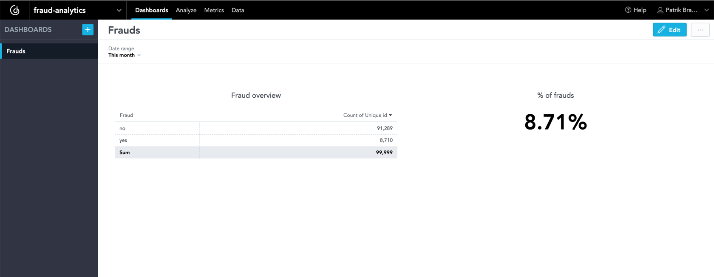

# Demo of fraud detection

Demo of fraud detection (card transaction) that utilize [dbt](https://www.getdbt.com/), [GoodData](https://www.gooddata.com/), and [ludwig](https://ludwig.ai/latest/).



## Big picture

- You can find fraud demo data in `data_transformation/seeds`.
- Load and transform of data does `dbt` tool.
  - Ideally, you should not utilize dbt for data loading, but for demo purposes, it is ok.
- Analytics of data and preparation for machine learning does `GoodData`.
- Training of machine learning model does `ludwig`.
- Prediction does `ludwig`.

## Demo

The following CSV contains fraud data:

```csv
unique_id,repeat_retailer,used_chip,used_pin_number,online_order,fraud,distance_from_home,distance_from_last_transaction,ratio_to_median_purchase_price
001e89532b377bdee3618f87cf866815,0,1,0,1,1,0.7976162474171549,0.11755681733346829,8.224685845159327
```

If you run the script `prediction.py` upon the mentioned data, the result will be as follows:

```bash
fraud_probabilities  fraud_predictions  fraud_probabilities_False  fraud_probabilities_True  fraud_probability
0  [0.24447894096374512, 0.7555210590362549]               True                   0.244479                  0.755521           0.755521
```

Trained model **successfully** detected fraud transaction. 

### Logbook

(to be removed)

- Init dbt project.
- Download data from kaggle.
- Put data [seeds](https://docs.getdbt.com/docs/building-a-dbt-project/seeds).
- Add macro to name schema models correctly.
- Database PostgreSQL, mention in the article they will need their own database.
- Create `input_stage` schema in the database.
- Setup project in dbt_project.yml (add output_stage schema and materialization setting).
- Add packages.yml with dbt_constraints to be able to define constraints.
- Add configuration for seed in order to put data to `input_stage`.
- Load data to database using `dbt seed`.
  - Mention in the article that it is ideal for demo purposes not production app.
- Prepare model for `output_stage`.
- Create labels for gooddata.
- Create [ids](https://docs.getdbt.com/blog/sql-surrogate-keys).
- Run dbt to put data into `output_stage`.
- Setup gooddata trial, etc.
- Create workspace `fraud-analytics`.
- Connect PG database with schema `output_stage`.
- Create insight fraud overview.
- Create metric % of frauds with headline.
- Create dashboard frauds.
- Create folder `machine_learning`.
- Create training (80%) and validation (20%) dataset.
- Fetch insights from GD and save to csv.
- Install ludwig
- Create predictions and train_model scripts.